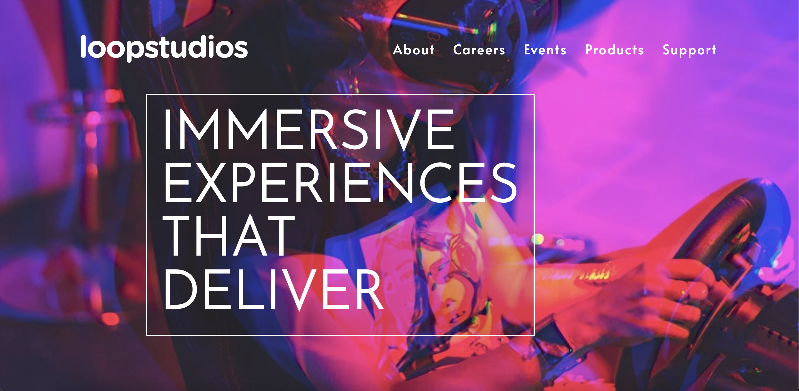

# Frontend Mentor - Loopstudios landing page solution

This is a solution to the [Loopstudios landing page challenge on Frontend Mentor](https://www.frontendmentor.io/challenges/loopstudios-landing-page-N88J5Onjw).

## Overview

### The challenge

Users should be able to:

- View the optimal layout for the site depending on their device's screen size
- See hover states for all interactive elements on the page

### Screenshot

### Links

- Solution URL: (https://www.frontendmentor.io/solutions/loopstudios-landing-page-with-react-and-sass-bjY4Uu2if0)
- Live Site URL:(https://frontend-mentor-loopstudios-landing-tau.vercel.app/)

## My process

### Built with

- Sass
- Flexbox
- Mobile-first workflow
- [React](https://reactjs.org/) - JS library

## Author

- Frontend Mentor - [@tarikdmrts](https://www.frontendmentor.io/profile/tarikdmrts)
